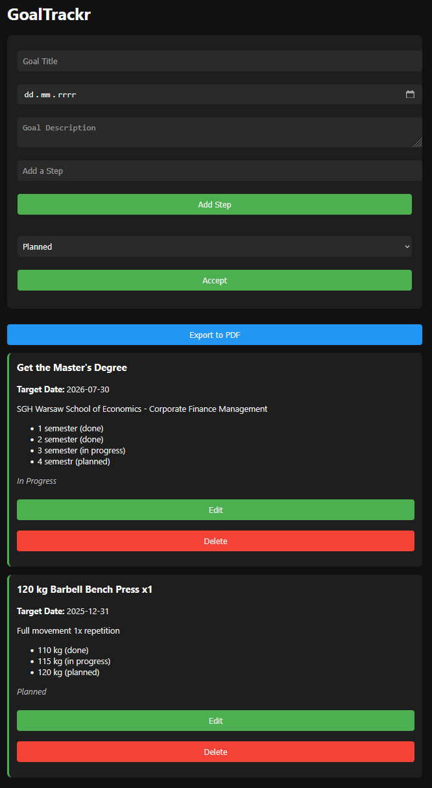

# GoalTrackr 🎯

**GoalTrackr** is a simple, stylish goal tracking web app that helps you stay organized and motivated. Create goals, add steps, track statuses and export your plans to PDF.


## 🚀 Features

* Add goals with a title, date, description, steps, and status
* Track your progress with **Planned**, **In Progress**, or **Completed** statuses
* Add and remove steps for each goal
* Edit or delete existing goals
* Save data in **localStorage** for persistence
* **Export your goals to PDF** with one click using `html2pdf.js`
* Fully responsive and dark-themed design

## 🔤 Live Demo

https://mateuszmachowina.github.io/GoalTrackr/

## 🛠️ Technologies Used

* HTML5
* CSS3 (Dark Theme)
* JavaScript (Vanilla)
* [html2pdf.js](https://www.npmjs.com/package/html2pdf.js) for PDF generation
* localStorage for data persistence

## 📂 File Structure

```
├── index.html         # Main HTML structure
├── style.css          # Styling and responsive layout
├── script.js          # App logic, goal handling, export feature
├── README.md          # You're here!
├── example.pdf        # Plan printed with the GoalTrckr
├── preview.png        # Screenshot of an example
```

## ✨ Future Improvements

* Search and filter goals
* Cloud sync and authentication
* Progress bar for goal completion
* Mobile-first improvements
* Improved PDF printing
